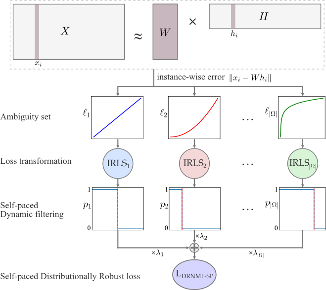

# DRNMF-SP
## Distributionally robust nonnegative matrix factorization with self-paced adaptive multi-loss fusion


  *Wafa Barkhoda, Amjad Seyedi, Nicolas Gillis, and Fardin Akhlaghian Tab*
  
  *Information Sciences 2026*

  
  *https://doi.org/10.1016/j.ins.2025.122823*

<p align=center></p>

  ## Abstract

Nonnegative Matrix Factorization (NMF) is a widely used technique for parts-based data representation, but its sensitivity to non-Gaussian noise and outliers limits robustness. Existing robust models typically address this issue by modifying the loss function to mitigate such outliers; however, they often lack generalization across diverse noise distributions. This paper proposes a novel framework, Distributionally Robust NMF with Self-Paced Adaptive Multi-Loss Fusion (DRNMF-SP), to enhance robustness against both moderate and extreme outliers across various noise types. DRNMF-SP adopts a multi-objective optimization strategy that integrates multiple loss functions through a weighted sum, reflecting the uncertainty in selecting a single objective. It employs a distributionally robust optimization, minimizing the worst-case expected loss over a probabilistic ambiguity set. The integration of self-paced learning enables the model to progressively learn from clean instances while deferring to noisy samples, thereby enhancing its robustness to heavy-tailed distributions. Additionally, the instance-wise loss function shifts focus from individual features to the holistic structure of samples, improving performance in real-world datasets. An efficient iterative reweighted algorithm ensures computational feasibility, with costs comparable to basic NMF. Experimental evaluations on benchmark datasets confirm that DRNMF-SP consistently outperforms existing robust methods across noisy, complex scenarios.

### Cite
```
@article{BARKHODA2026122823,
title = {Distributionally robust nonnegative matrix factorization with self-paced adaptive multi-loss fusion},
journal = {Information Sciences},
volume = {728},
pages = {122823},
year = {2026},
issn = {0020-0255},
doi = {https://doi.org/10.1016/j.ins.2025.122823},
url = {https://www.sciencedirect.com/science/article/pii/S0020025525009594},
author = {Wafa Barkhoda and Amjad Seyedi and Nicolas Gillis and Fardin {Akhlaghian Tab}},
keywords = {Nonnegative matrix factorization, Distributionally robust optimization, Self-paced learning, Instance-wise representation},
}
```
